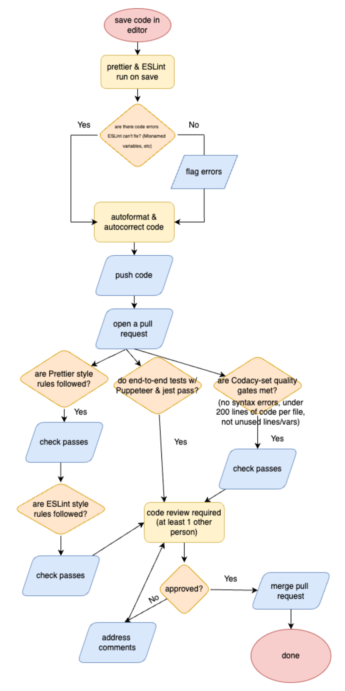

# Updated and Improved CI-CD Pipeline

## Overview

This is our second status report on our current CI/CD pipeline for Card Create; it covers both implemented **functional** stages (newly added since checkpoint 1) and **planned/in-progress** enhancements.

---

## 1. Current Functionality

1. **Code Style: Pre-Commit & Post-Commit Linting**
   - (From phase 1) ESLint and Prettier extensions downloaded for in-editor formatting
   - ESLint and Prettier integrated with Github Actions to enforce styling when PR opened
     - why each developer needs to make sure to have the extensions downloaded
2. **Code Quality: Post-Commit Check**
   - **NEW:** Integrated Codacy with Github repo to cross-check js, css, html files for quality
     - includes ensuring that there are no repeated code chunks, no unused lines
     - no unused variables, no syntax errors
     - no bulky files w/ over 200 lines of code
3. **Testing**

   - **NEW:** Puppeteer is used to stimulate user interactions with buttons and link clicks on Card Create
   - Its used alongside Jest to test that the changes we expect are occurring
   - These tests are integrated into our workflow to run when a Pull Request to main is opened

4. **Documentation Generation**  
   • JSDoc generates HTML docs, published under `/docs` on successful test runs.

5. **Build GitHub Website**  
   • Automated build of the documentation website upon commit.

## 2. Planned & In-Progress Enhancements

- **Integration Testing (In Progress)**  
  • Writing unit + e2e tests with Jest and Puppeteer for app functionality as we go, and rigorously checking to make sure the tests work
  - Whenever work is done on an issue, testing for the implemented functionality will be expected as part of the pull request
- **JSDocs Site Visualization**
  • Configuring JSDocs w/ Github pages and allowing JSDocs to auto-push to its visualization website so we can easily view our documentation
- **Automatic Staging Deploys (Planned)**  
  • Configure GitHub Actions to deploy successful builds to a staging environment.  
  • Enables QA team to verify production-like behavior before release.
